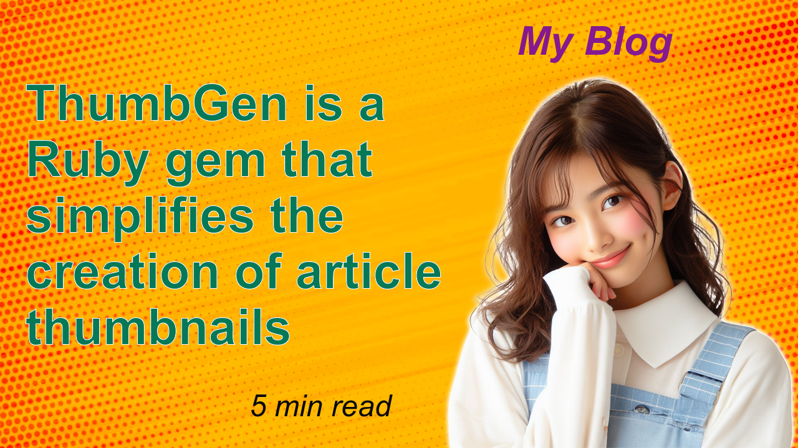

# ThumbGen

Welcome to ThumbGen, a powerful Ruby gem designed to facilitate the dynamic generation of images with customized text overlays. This tool leverages RMagick to provide robust image manipulation capabilities, making it ideal for applications needing automated graphic content creation, such as generating thumbnails, promotional banners, or personalized images.


Input Image | Output Image
:-------------------------:|:-------------------------:
  |  


## Installation

To install ThumbGen, simply add it to your application's Gemfile:

```bash
bundle add thumb_gen
```

Alternatively, you can install it yourself as:


```bash
gem install thumb_gen
```

## Usage

ThumbGen is easy to use with an intuitive API. Here's a basic example of how to generate an image with text overlays:

```ruby
output_path = 'sample_output.jpg'
background_url = 'sample_input.jpg'
texts = [
  {
    text: 'ThumbGen is a Ruby gem that simplifies the creation of article thumbnails',
    wrapped_width: 800,
    font_size: 80,
    style: 'bold',
    color: '#047857',
    outline_color: '#f8fafc',
    outline_width: 1,
    gravity: 'northwest',
    position_x: 40,
    position_y: 120
  },
  {
    text: '5 min read',
    wrapped_width: 800,
    font_size: 48,
    style: 'italic',
    color: '#09090b',
    gravity: 'southwest',
    position_x: 400,
    position_y: 40
  },
  {
    text: 'My Blog',
    wrapped_width: 1280,
    font_size: 64,
    style: 'bold-and-italic',
    color: '#86198f',
    gravity: 'northeast',
    position_x: 200,
    position_y: 30
  }
]
options = {
  width: 1280,
  height: 720,
  format: 'jpg'
}

# Generate the image
ThumbGen.generate(output_path, background_url, texts, options)
```

## Development

After checking out the repo, run `bin/setup` to install dependencies. Then, run `rake spec` to run the tests. You can also run `bin/console` for an interactive prompt that will allow you to experiment.

To install this gem onto your local machine, run `bundle exec rake install`. To release a new version, update the version number in `version.rb`, and then run `bundle exec rake release`, which will create a git tag for the version, push git commits and the created tag, and push the `.gem` file to [rubygems.org](https://rubygems.org).

## Contributing

Bug reports and pull requests are welcome on GitHub at https://github.com/YutoYasunaga/thumb_gen.

## License

The gem is available as open source under the terms of the [MIT License](https://opensource.org/licenses/MIT).