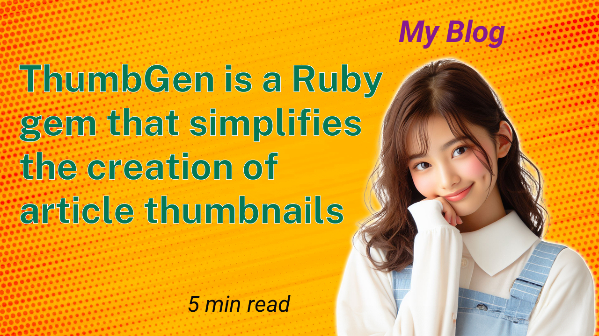

# ThumbGen

Welcome to ThumbGen, a powerful Ruby gem designed to generate images with customized text overlays.  
Perfect for automating thumbnail creation, blog banners, and promotional images.

---

## 🖼️ Example

Input Image | Output Image
:-------------------------:|:-------------------------:
 | 

---

## 💎 Installation

Add to your Gemfile:

```bash
bundle add thumb_gen
```

Or install manually:

```bash
gem install thumb_gen
```

---

## ✨ Usage

You can generate an image by providing background, output path, and an array of text overlays:

```ruby
require 'thumb_gen'

output_path = 'sample_output.jpg'
background_url = 'sample_input.jpg'

texts = [
  {
    text: 'ThumbGen is a Ruby gem that simplifies the creation of article thumbnails',
    wrapped_width: 800,
    font: 'PublicSans-Bold',
    font_size: 80,
    color: '#047857',
    outline_color: '#f8fafc',
    outline_width: 1,
    gravity: 'northwest',
    position_x: 40,
    position_y: 120
  },
  {
    text: '5 min read',
    wrapped_width: 800,
    font: 'Roboto-Italic',
    font_size: 48,
    color: '#09090b',
    gravity: 'southwest',
    position_x: 400,
    position_y: 40
  },
  {
    text: 'My Blog',
    wrapped_width: 1280,
    font: 'Roboto-BoldItalic',
    font_size: 64,
    color: '#86198f',
    gravity: 'northeast',
    position_x: 200,
    position_y: 30
  }
]

options = {
  width: 1280,
  height: 720,
  format: 'jpg'
}

ThumbGen.generate(output_path, background_url, texts, options)
```

> Font files like `Roboto-BoldItalic.ttf` are bundled in the gem’s `fonts/` folder.  
Use only the filename **without extension** as the `font:` value.

- PublicSans-Regular
- PublicSans-Bold
- PublicSans-BoldItalic
- PublicSans-Thin
- PublicSans-ThinItalic
- Roboto-Regular
- Roboto-Bold
- Roboto-BoldItalic
- Roboto-Italic
- Roboto-Thin
- Roboto-ThinItalic
- For Japanese:
  - NotoSansJP-Regular
  - NotoSansJP-Bold
  - NotoSansJP-Thin
- For Korean:
  - NotoSansKR-Regular
  - NotoSansKR-Bold
  - NotoSansKR-Thin
- For Simplified Chinese
  - NotoSansSC-Regular
  - NotoSansSC-Bold
  - NotoSansSC-Thin

---

## 🛠 Development

After cloning the repo, install dependencies:

```bash
bin/setup
```

Run tests:

```bash
rake spec
```

Try it in IRB:

```bash
bin/console
```

To install the gem locally:

```bash
bundle exec rake install
```

To release a new version:

1. Update the version in `lib/thumb_gen/version.rb`
2. Run:

```bash
bundle exec rake release
```

---

## 🤝 Contributing

Bug reports and pull requests are welcome at:  
[https://github.com/YutoYasunaga/thumb_gen](https://github.com/YutoYasunaga/thumb_gen)

---

## 📄 License

Released under the [MIT License](https://opensource.org/licenses/MIT)
